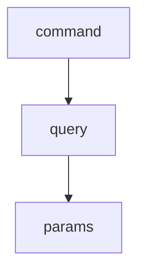
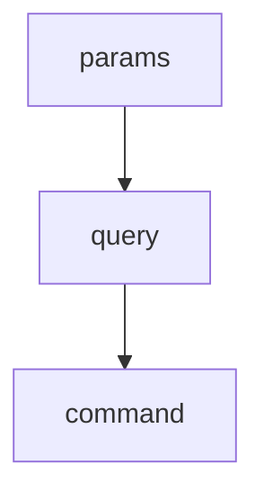

# Nina

[](https://codeclimate.com/github/andriy-baran/nina/maintainability)
[](https://codeclimate.com/github/andriy-baran/nina/test_coverage)

DSL for simplifying complex objects compositions. Also it reduce biolerplate code when you need to create complex OOD compositions. It's based on https://github.com/andriy-baran/toritori so please check it first

## Installation

Install the gem and add to the application's Gemfile by executing:

    $ bundle add nina

If bundler is not being used to manage dependencies, install the gem by executing:

    $ gem install nina

## Usage

Let's define two builders: main and secondary

```ruby
Params = Class.new
Query = Class.new
Command = Class.new

A = Struct.new(:a)
B = Struct.new(:b)
C = Struct.new(:c)

class Flow
  include Nina

  builder :main do
    factory :params, produces: Params
    factory :query, produces: Query
    factory :command, produces: Command
  end

  builder :secondary do
    factory :params, produces: A
    factory :query, produces: B
    factory :command, produces: C
  end
end
```
Each builder has three factories: params, query, and command. Please check https://github.com/andriy-baran/toritori for related documentation.

With this setup we are able to compose objects in two different ways. Taking the definition block as an ordered list we can traverse it `top->bottom` or `bottom->top` connecting objects at each step

Wrapping `top->bottom`

Nesting `bottom->top`

Lets explore what we have as a result
```ruby
# Wrapping strategy
builder = abstract_factory.main_builder
instance = builder.wrap
instance # => #<Command>
instance.query # => #<Query>
instance.query.params # => #<Params>

# Nesting strategy
builder = abstract_factory.secondary_builder
instance = builder.nest
instance # => #<A>
instance.query # => #<B>
instance.query.command # => #<C>
```
We may apply delegation techique from OOD to hide deeper layers of resulted object
```ruby
builder = abstract_factory.secondary_builder
instance = builder.nest(delegate: true)
instance.a # => nil
instance.b # => nil
instance.c # => nil
```
If you need provide an initalization parameters for the objects
```ruby
instance = builder.wrap(delegate: true) do |b|
  b.params(1)
  b.query(2)
  b.command(3)
end
instance.a # => 1
instance.b # => 2
instance.c # => 3
instance.query.c # => 3
```
To do something between stages (after creation of object)
```ruby
instance = builder.wrap(delegate: true) do |b|
  b.params { _1.a = 'a' }
  b.query { _1.b = 'b' }
  b.command { _1.c = 'c' }
end
instance.a # => 'a'
instance.b # => 'b'
instance.c # => 'c'
```

## Development

After checking out the repo, run `bin/setup` to install dependencies. Then, run `rake spec` to run the tests. You can also run `bin/console` for an interactive prompt that will allow you to experiment.

To install this gem onto your local machine, run `bundle exec rake install`. To release a new version, update the version number in `version.rb`, and then run `bundle exec rake release`, which will create a git tag for the version, push git commits and the created tag, and push the `.gem` file to [rubygems.org](https://rubygems.org).

## Contributing

Bug reports and pull requests are welcome on GitHub at https://github.com/[USERNAME]/nina. This project is intended to be a safe, welcoming space for collaboration, and contributors are expected to adhere to the [code of conduct](https://github.com/[USERNAME]/nina/blob/master/CODE_OF_CONDUCT.md).

## License

The gem is available as open source under the terms of the [MIT License](https://opensource.org/licenses/MIT).

## Code of Conduct

Everyone interacting in the Nina project's codebases, issue trackers, chat rooms and mailing lists is expected to follow the [code of conduct](https://github.com/[USERNAME]/nina/blob/master/CODE_OF_CONDUCT.md).
